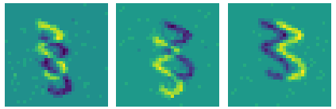

Getting started
===============

With Tonic you can do 2 major things:

1. Load event-based datasets
2. Add transforms to the dataset that are automatically applied every time you load a new sample.

Loading data
------------

Let's start with the basics, let's say you would like to work on N-MNIST, the neuromorphic equivalent of the popular MNIST dataset.
::

  import tonic

  dataset = tonic.datasets.NMNIST(save_to='./data',
                                  train=True,
                                  download=True)

Now you can index the samples manually for inspection! Depending on the dataset, you can expect different return values. N-MNIST returns events and the target class for each sample. Other datasets provide images, IMU data, GPS data and more. You will find the details in the :doc:`datasets <datasets>` section.
::

  events, target = dataset[1000]

Let's visualise those events by making use of a util function:
::

  tonic.utils.plot_event_grid(events, dataset.ordering)

You can see nicely the three saccades for this sample. The bright and dark version of the digit is because an event camera outputs two polarities, one for ON events that signify an increase in illuminance, and one for OFF events that signify a decrease.

Applying a transform manually
-----------------------------
In the previous plot we can see some isolated noise events, let's try to get rid of them. We'll use a transform that deletes such isolated events, and then apply it to our events:
::

  import tonic.transforms as transforms

  transform = tonic.transforms.Compose([tonic.transforms.Denoise(filter_time=10000)])
  events_denoised = transform(events, dataset.sensor_size, dataset.ordering)

.. image:: _static/nmnist-events-denoised.png
      :alt: denoised N-MNIST events plot

That looks a bit cleaner!

Converting to different representation
--------------------------------------
The raw events are decoded as numpy arrays in the format (NxE), where N is the number of events and E is the number of event channels. This is the most compact format for events. Not everyone will want this raw format to work with, so you can apply some transformations to convert the events into different representations. The plotting function earlier for example makes use of a transform to voxel grids. There are many representations available that you can find in :doc:`transformations <transformations>`.
Let's have a look now at how we can transform the events to a sparse tensor, using PyTorch's sparse module.
::

  import tonic.transforms as transforms

  transform = transforms.Compose([transforms.ToSparseTensor()])
  sparse_tensor = transform(events, dataset.sensor_size, dataset.ordering)

This gives us a (TCWH) tensor, where T is the maximum time stamp, C is the number of polarities, and W/H are the sensor size.
::

  tensor(indices=tensor([[   920,   1538,   3464,  ..., 303653, 307109, 307434],
                       [     0,      0,      0,  ...,      0,      1,      1],
                       [    12,     13,     12,  ...,     12,     21,     32],
                       [     7,     17,     16,  ...,     12,     24,     22]]),
       values=tensor([1., 1., 1.,  ..., 1., 1., 1.]),
       size=(307435, 2, 34, 34), nnz=4083, layout=torch.sparse_coo)

Putting it all together
-----------------------
Previously we applied the transformations manually. We can simplify this code, by chaining the transforms and passing them to our dataset.
::

  transform = transforms.Compose([tonic.transforms.Denoise(10000),
                                transforms.ToSparseTensor()])
  dataset = tonic.datasets.NMNIST(save_to='./data',
                                  train=True,
                                  download=True,
                                  transform=transform)
  sparse_tensor, target = dataset[1000]

Now the transforms will be applied whenever a new sample is loaded. To simplify the loading, we make use of a PyTorch DataLoader in a final step:
::

  import torch

  dataloader = torch.utils.data.DataLoader(dataset, shuffle=True)
  sparse_tensor, target = next(iter(dataloader))

And that's there is to it! There are a few more short examples available :doc:`here <examples>`.
