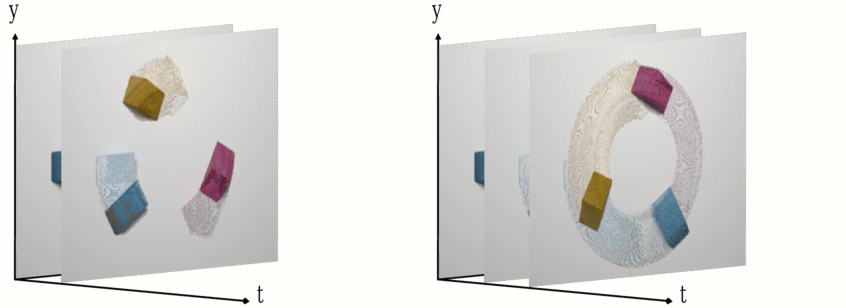
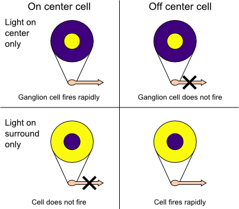
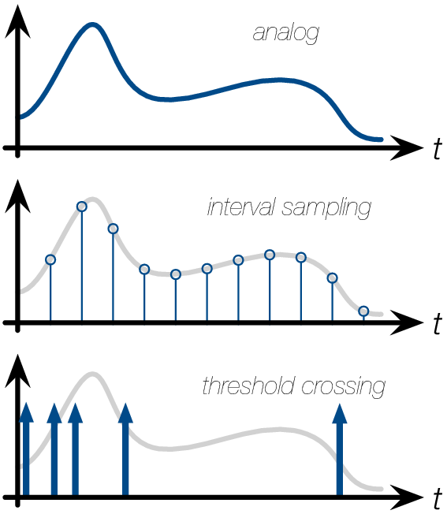
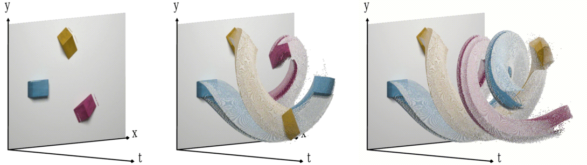

Rethinking the Way our Cameras See
==================================

We want machines to be able to see like us, and in that effort have
created cameras. The field of modern computer vision is based on the
common output format of those sensors: frames. However, the way we
humans perceive the world with our eyes is very different. Most
importantly, we do it with a fraction of the energy needed by a
conventional camera. The field of
neuromorphic vision tries to understand how our visual system processes
information, in order to give modern cameras that same efficiency and it
looks like a substantial shift in technology for machine vision.

We are so focused on working with data that modern cameras provide, that
little thought is given about how to capture a scene more efficiently in
the first place. Current cameras acquire frames by reading the
brightness value of all pixels at the same time at a fixed time
interval, the frame rate, regardless of whether the recorded information
has actually changed. A single frame acts as a photo; as soon as we
stack multiple of them per second it becomes a motion picture. This
synchronous mechanism makes acquisition and processing predictable. But
it comes with a price, namely the recording of redundant data. And not
too little of it. As shown in
Figure `1 <#fig:event-cameras-framestream>`__, redundant information
about the background is captured even though it does not change from
frame to frame, when at the same time, high velocity scene activity
results in motion blur.

   Image blur can occur in a frame depending on the exposure time.

Taking Inspiration from the Human Visual System
-----------------------------------------------

The human retina has evolved to encode information extremely
efficiently. Narrowing down the stimuli of about 125 million light
sensitive photoreceptors to just 1 million ganglion cells which relay
information to the rest of the brain, the retina compresses a visual
scene into its most essential parts. Photoreceptor outputs are bundled
into receptive fields of different sizes for each retinal ganglion cell
as shown in Figure `2 <#fig:event-cameras-receptive-field>`__. The way a
receptive field in the retina is organised into center and surround
allows ganglion cells to transmit information about spatial contrast,
encoded as the differences of firing rates of cells in the center and
surround. Retinal ganglion cells are furthermore capable of firing
independently of each other, thus decoupling the activity of receptive
fields from each other. Even if not triggered by external stimulus, a
retinal ganglion cell will have a spontaneous firing rate, resulting in
millions of spikes per second that travel along the optic nerve. It is
thought that in order to prevent the retinal image from fading and thus
be able to see the non-moving objects, our eyes perform unintentional
rapid jumps called micro-saccades. This movement only happens once or
twice per second, so in between micro-saccades, our vision system
probably relies on motion. To put it in a nutshell, our retina acts as a
pre-processor for our visual system, extracting contrast as an important
stream of information that then travels along the optical nerve to the
visual cortex. In the cortex it is processed for higher-level conscious
processing of the visual scene.

   Center-surround receptive fields in the mammalian retina.

Inspired by the efficiency and complexity of the human visual system,
Misha Mahowald developed a new artificial stereo vision system in the
late 80s. She was one of
Carver Mead’s students, a scientist at Caltech who spawned the field of
Neuromorphic Engineering at that time. In his lab, Misha built what
would become the first silicon retina in the early
90s. It was based on the same
principle of center-surround receptive fields in the human retina, which
emit spikes independently of each other depending on the contrast
pattern observed.

Although Misha drafted the beginning of a new imaging sensor, the design
did not provide a practical implementation at first. In response, the
neuromorphic community simplified the problem by dropping the principle
of center-surround pixels. Instead
of encoding spatial contrast across multiple pixels which needed
sophisticated circuits, the problem could be alleviated by realising a
circuit that could encode *temporal* contrast for single pixels. That
way, pixels could still operate individually as processing units just as
receptive fields in the retina do and report any deviations in
illuminance over time. While the first silicon retinas where fully
analog, it
would take until 2008 when the first refined temporal contrast sensors
was published based on digital
architecture, the event cameras
as they are known today.

A Paradigm Shift in Signal Acquisition
--------------------------------------

The new architecture led to a paradigm shift in signal acquisition,
illustrated in Figure `3 <#fig:event-cameras-sampling-theorems>`__.
Standard cameras capture absolute illuminance at the same time for all
pixels driven by a clock and encoded as frames. One fundamental approach
to dealing with temporal redundancy in classical videos is frame
difference encoding. This simplest form of video compression includes
transmitting only pixel values that exceed a defined intensity change
threshold from frame to frame after an initial key-frame. Frame
differencing is naturally performed in post-processing, when the data
has already been recorded. Trying to take inspiration from the way our
eyes encode information, event cameras capture changes in illuminance
over time for individual pixels corresponding to one retinal ganglion
cell and its receptive field.

   Different sampling theorems. The ’real world’ is a collection of
   analog signals, which in order to store and digitise it we transform
   into numbers. Digital signal acquisition relies on regular sampling
   along the time axis. An alternative approach is level or threshold
   crossing, where the signal is sampled whenever it surpasses a
   threshold on the y-axis.

If light increases or decreases by a certain percentage, one pixel will
trigger what’s called an event, which is the technical equivalent of a
cell’s action potential. One event will contain information about a
timestamp, x/y coordinates and a polarity depending on the sign of the
change. Pixels can trigger completely independently of each other,
resulting in an overall event rate that is directly driven by the
activity of the scene. It also means that if nothing moves in front of a
static event camera, no new information is available hence no pixels
fire apart from some noise. The absence of accurate measurements of
absolute lighting information is a direct result of recording change
information. This information can be refreshed by moving the event
camera itself, much like a saccade.

Because of the considerable size of the circuit that enables temporal
contrast for each pixel, it didn’t leave much room for the photo diode
to capture incoming photons. The ratio of a pixel’s light sensitive area
versus the total area is called fill factor and amounted to 9.4% for the
first event camera. Modern CMOS
(Complementary Metal Oxide Semiconductor) technology will enable a fill
factor of above 90% at a fabrication process of 180 nm. With a reduced
fill factor the photon yield will be low, which will in turn drive image
noise. This was thus a major obstacle for event camera mass production
early on. Nevertheless already this first camera was able to record
contrast changes under moonlight conditions. New generations of event
cameras use backside illumination in order to decouple the processing
circuit for each pixel from the photo diode, by flipping the silicon
wafer during manufacturing. Most of
today’s smartphone cameras already use backside illumination in order to
maximise illumination yield at the expense of fabrication cost.

   An event-camera will only record change in brightness and encode it
   as events in x, y and time. Colour is artificial in this
   visualisation. Note the fine-grained resolution on the t-axis in
   comparison with the frame animation in
   Figure `1 <#fig:event-cameras-framestream>`__. Thanks to Alexandre
   Marcireau for the data. Visualisation has been created using
   Rainmaker.

A Novel Sensor for Machine Vision
---------------------------------

Overall an event camera has three major advantages compared to
conventional cameras: since pixel exposure times are decoupled of each
other, very bright and very dark parts can be captured at the same time,
resulting in a dynamic range of up to 125dB. The decoupled, asynchronous
nature furthermore frees bandwidth so that changes for one pixel can be
recorded at a temporal resolution and latency of microseconds. This
makes it possible to track objects with very high speed and without blur
as exemplified in Figure `4 <#fig:event-cameras-eventstream>`__. The
third advantage is low power consumption due to the sparse output of
events, which makes the camera suitable for mobile and embedded
applications. As long as nothing in front of the camera moves, no
redundant data is recorded by the sensor which reduces computational
load overall. It also relieves the need for huge raw data files. Current
drawbacks for most commercially event cameras available today are
actually further downstream, namely the lack of hardware and algorithms
that properly exploit the sparse nature of an event camera’s data.
Rethinking even the most basic computer vision algorithms without frames
takes a considerable effort.

Over the years, event cameras have seen drastic improvements in spatial
resolution and signal to noise ratio. The main generations of cameras
are DVS, ATIS and DAVIS. Examples of companies that
produce commercially available event cameras are
Samsung, Prophesee, Celepixel and Sony/Insigthness. Most commercially
available event cameras are still large in size, but small form factor
version have been developed too. The first commercially available 
single-chip neuromorphic vision system for mobile
and iot applications is called Speck [1]_, which combines a dvs and the
Dynap-se neuromorphic cnn processor. The rise of the event camera has
been relatively slow, as larger gains in power efficiency are being made
by focusing on the processing of image data further downstream, notably
on a gpu. This trend however is also likely to saturate at some point
and will make it worth to further explore and employ this novel image
sensor.

.. [1]
   https://www.speck.ai/
