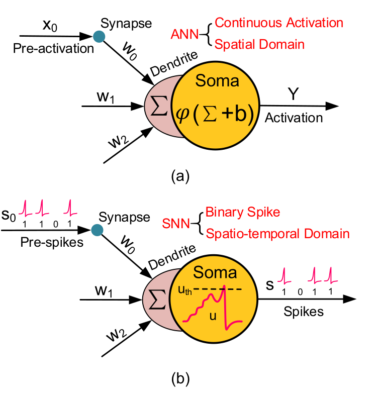
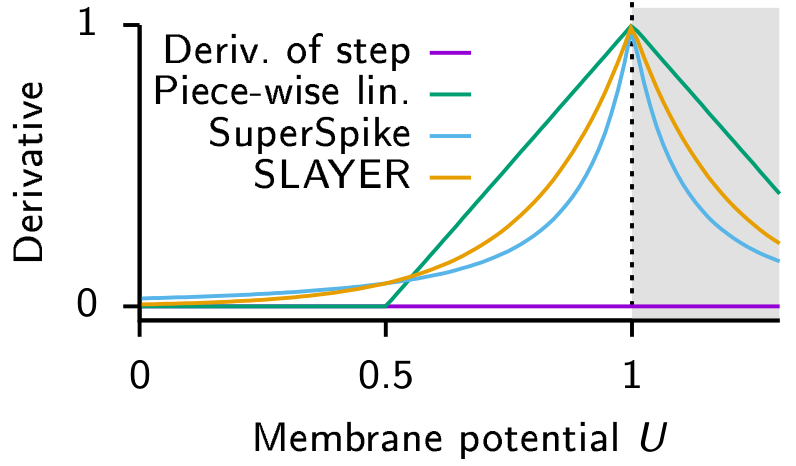

Short intro to spiking neural networks
========================================

Sparse Data Representations
---------------------------

In spiking neural networks (SNN), which are labelled as the 3rd generation neural network
archetype, data is represented in binary form,
where a neuron can either spike or not. Every neuron has an internal
state such as membrane potential, threshold and decay times. Neurons in
an SNN do not fire
automatically when new input is presented, but only when enough spikes
per time unit accumulate so as to push the membrane potential across its
threshold. The spike emitted will then be propagated forward, subject to
synapse weights and delays. The sparse nature of communication offers
the potential to encode and transmit information in a significantly more
energy efficient manner.

Figure 1 shows the principal difference
between a neuron unit in an ANN and in an SNN. Whereas the input for an
ANN is typically a
tensor with high data precision, but low temporal resolution, the input
for an SNN are
binary flags of spikes with comparatively high temporal precision in the
order of s. The unit in the SNN integrates all of the incoming spikes,
which affect the internal parameters such as membrane potential. The
unit in the ANN
merely computes the linear combination for inputs on all synapses and
outputs that. Although there are ANN units with memory characteristics and
internal states such as recurrent or long short-term memory
units, they typically
operate on much wider time frames such as a few words in a sentence or a
video frame that is captured every 25 ms.

   
   Basic neuron model in an ANN compared to an SNN. Picture taken from Deng et al. 2020.

The development in SNNs has focused to a great extent on vision
tasks such as image classification or object detection, largely driven
by the need to compare new work to existing classical architectures.
However, SNNs are
likely not going to outperform ANNs in every aspect, but rather fill a
niche. What this niche is, is an interesting research question at the
moment. Some groups have developed spiking sorting
algorithms, or spike time encoded addressable
memory. Certainly the ability for near-sensor feature
extraction, ultra-low power neural network inference, local continual
learning or constraint satisfaction
problems are tasks where
SNNs can already
excel. The stateful, recurrent architecture of RNNs also seems suitable to be mapped to
SNNs.

There are other areas of artificial intelligence that are little
explored when it comes to employing SNNs, such as in reinforcement
learning or attention-based models. Deep
reinforcement learning uses deep learning to model complex value
functions for continuous high-dimensional state spaces that allows an
agent to perform actions even though while training it only encountered
a small subset of states during trial and error
learning. Deep reinforcement
learning suffers from high sensitivity to noisy, incomplete, and
misleading input data and SNNs with their inherent stochastic nature
could provide some robustness to that. In the same
vein, ANNs are
notoriously sensitive to malevolent adversarial attacks. Sharmin et al.
demonstrate that SNNs tend to show more resiliency compared to
ANN under black box
attack scenario, which could help deploy them in real-world
scenarios.

So far SNNs have
not proven that they perform better in general. The rise of
attention-based deep neural network architectures called
transformers make it
clear that time and recurrent architectures are not a necessity when
computing on sequences. They allow for parallel training on multiple
tokens at the same time but need lots of parameters. Transformers are
causing a stir in deep learning and are being used not only in natural
language processing but also vision and audio tasks. However, they work
with highly dense training data such as images and regularly sampled
audio files. A crucial point that neuromorphic computing relies on is
sparsity. This is, after all, the strength of event-based sensing and
the principle of threshold crossing. No change in the input signal means
no data recorded. Nevertheless there are different training methods how
an SNN can extract
features from input data.

Training Spiking Neural Networks
--------------------------------

Training SNNs follows one of 3 major pathways: converting the weights 
of pre-trained ANNs,
supervised learning using backpropagation with
spikes or local learning rules based on STDP
or other local errors. The most straightforward path to
create an SNN is to convert an ANN
which had previously been trained on a GPU. The idea is to trade a small impact in
performance for reduced latency and power efficiency. Continuous values
are hereby transformed into rate-coded
schemes. Alternatively, the network can also
be converted using a temporal coding scheme. Converted SNNs benefit from a large ecosystem available
for GPU-based
training of ANNs and certain training mechanisms such as batch
normalisation or dropout.

   
   Commonly used derivatives as a replacement for spike activation to
   provide a differentiable signal when training spiking neural networks.
   The step function has zero derivative (violet) everywhere except at 0
   where it is ill defined. Examples of replacement derivatives which have
   been used to train SNNs are in Green: Piece-wise linear. Blue: Derivative
   of a fast sigmoid. Orange: Exponential. Figure taken from Neftci et al. 2019.

In order to facilitate learning in an SNN directly, we can apply methods from
classical neural network training, such as backpropagation through
time, to our SNN. Since the activation of a single spike,
which resembles a Dirac impulse, is not differentiable, methods resort
to smoothing spike activation
itself as shown in Figure 2. A recent method has also adapted
backpropagation to spikes without
approximations. Training methods using a
global error signal achieve very good results, but are not very
plausible to happen in the brain. SNNs that have been trained directly with
backpropagation have yet to achieve the accuracy of converted
SNNs when it comes
to deeper networks, but the end-to-end training also speeds up the
overall time needed for one network propagation and therefore reduces
latency.

Local learning rules strive for biological plausibility without
sacrificing performance too much. *DECOLLE* and
*e-prop* are two recent examples of those
algorithms that can both be implemented in neuromorphic hardware.
Lastly, unsupervised feature extraction using local learning rules such
as STDP relies purely on the timing between pre- and postsynaptic spike. It is
biological plausible since it is without need for a global error signal,
but has yet to reach ANN performance. The introduction of a third
factor such as a global reward signal to complement the learning
rule seems like a
promising path forward. Overall, event-based vision promises efficient
processing for naturally sparse inputs. An asynchronous network such as
an SNN however
needs asynchronous hardware to fully exploit its advantages.
